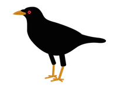

# crow-metrics



Crow is a library for collecting metrics about your server, similar to Twitter's Ostrich or Netflix's Servo.(\*) It helps you track things like:

- How many requests am I handling per second?
- How many requests am I handling concurrently?
- What is the 90th percentile of latency in my database queries?

On a period of your choosing (for example, minutely) these metrics are summarized. You can then publish them to a graphing or monitoring system like Riemann, InfluxDB, Graphite, or Prometheus.

The goal of crow is to make it *dead simple* to collect and report these metrics, and to motivate you to add them everywhere!

(\*) Servo? Crow? _Get it?_ Ha ha ha.

- [Example](#example)
- [How does it work?](#how-does-it-work)
- [API](#api)
  - [Registry](#registry)
- [Metrics objects](#metrics-objects)
  - [Gauge](#gauge)
  - [Counter](#counter)
  - [Distribution](#distribution)
- [How distributions work](#how-distributions-work)
- [Built-in plugins](#built-in-plugins)
  - [Prometheus](#prometheus)
  - [Viz](#viz)

## Example

Here's a quick example of a web service that counts requests and response times, and publishes them in a format [prometheus](http://prometheus.io/) can poll:

```javascript
var crow = require("crow-metrics");
var express = require("express");

var webService = express();

// one registry to rule them all, publishing once a minute.
var metrics = new crow.Registry({ period: 60000 });

// publish metrics to /metrics, formatted for prometheus.
webService.use("/metrics", crow.prometheusExporter(express, metrics));

// track heap used as a gauge, just for fun.
metrics.setGauge("heap_used", function () { return process.memoryUsage().heapUsed; });

webService.get("/", function (request, response) {
  metrics.counter("request_count").increment();

  metrics.distribution("request_time_msec").time(function () {
    response.send("Hello!\n");
  });
});
```

## How does it work?

Metrics consist of:

- **counters**: things that only increase, like the number of requests handled since the server started.
- **gauges**: dials that measure a changing state, like the number of currently open connections, or the amount of memory being used.
- **distributions**: samples that are interesting for their histogram, like timings (95th percentile of database reads, for example).

Metrics are collected in a `Registry` (usually you create only one). On a configurable period, these metrics are summarized and sent to observers. The observers can push the summary to a push-based service like Riemann, or post the results to a web service for a poll-based service like Prometheus.

Each metric has a name, which is a string. Crow doesn't care what's in the string, but if you're sending metrics to a service, most of them have a naming convention. In general, you should use a name that could be an identifier (starts with a letter, contains only letters, digits, and underscore). Some metrics services use dot to build folder-like namespaces. Typical metric names are:

- `requests_received`
- `mysql_select_count`
- `users_query_msec`

The last one is an example of a timing. Usually timings should include the time unit as the last segment of their name, as a convention.

Each metric may also have a set of "tags" attached. A tag is a name/value pair, both strings, that identifies some variant of the metric. For example, a request handler may use a different tag for successful operations and exceptions. When generating string forms of metrics, the tags are appended in alphabetical order, separated by commas, surrounded by curly braces. (This is a standard form used by most of the open-source metrics services.)

- `requests_handled{success=true}`
- `requests_handled{exception=IOError}`
- `requests_handled{exception=AccessDenied}`

Tags are used by metrics services to split out interesting details while allowing the general case (`requests_handled` above) to be summarized.

## API

- `new Registry(options)`

  The registry is the central coordinator for metrics collection and dispersal. It tracks metrics in a single namespace, and periodically takes a snapshot and sends it to any observers. (A typical observer might push the metrics into riemann, influxdb, or prometheus.)

  Options:

  - `period` (in milliseconds) - how often to send snapshots to observers; default is 60_000, or one minute
  - `log` - a bunyan-compatible logger to use for debug logs; if no log is provided, nothing is logged
  - `percentiles` (array) - percentiles to collect on distributions, as a real number between 0 and 1; default is `[ 0.5, 0.9, 0.99 ]`, or the 50th (median), 90th, and 99th percentiles
  - `error` - number between 0 and 1 representing the rank error allowed when estimating percentiles; default is 0.01 (1%) which is usually fine
  - `tags` - (object of string keys & values) set of tags to apply by default to every metric; often used for instance-wide tags like `instanceId` or `hostname`

  The `percentiles` and `error` options are used as defaults and may be overridden by individual distributions. For more about how the distributions are calculated, see [distributions](#distributions) below.

- `prometheusExporter(express, registry)`

  See the [prometheus plugin](#prometheus) below.

- `viz(express, registry, span = 60 * 60 * 1000)`

  See the [viz plugin](#viz) below.

- `startVizServer(express, registry, port = 8080)`

  See the [viz plugin](#viz) below.

### Registry

- `counter(name, tags = {})`

  Return a new or existing counter with the given name and tags. Counter objects may be cached, or you may call `counter` to look it up each time. See [Metrics objects](#metrics-objects) below for the counter object API.

- `setGauge(name, tags = {}, getter)`

  Build a new gauge with the given name, tags, and "getter". The "getter" is usually a function that will be called when crow wants to know the current value. If the value changes rarely, `getter` may be a number instead, and you can call `setGauge` with a new number each time the value changes.

- `gauge(name, tags = {})`

  Return the gauge with the given name and tags. If no such gauge is found, it throws an exception. See [Metrics objects](#metrics-objects) below for the gauge object API.

- `distribution(name, tags = {}, percentiles = this.percentiles, error = this.error)`

  Return a new or existing distribution with the given name and tags. If `percentiles` or `error` is non-null, they will override the registry defaults. See [Metrics objects](#metrics-objects) below for the distribution object API.

- `withPrefix(prefix)`

FIXME...

- `addObserver(observer)`

FIXME...

## Metrics objects

All metrics objects created by a `Registry` have a field `type` which is one of the following values:

- `MetricType.GAUGE`
- `MetricType.COUNTER`
- `MetricType.DISTRIBUTION`

Other methods vary based on the type:

### Gauge

- `get()`

  Return the current value of the gauge by calling its getter.

### Counter

- `get()`

  Return the current value of the counter.

- `increment(count = 1, tags = {})`

  Increment the counter. If `tags` is given, it's a shortcut for calling `withTags()` first.

- `withTags(tags)`

  Return a new or existing counter with the same name as this one, but different tags. This is useful if you have a cached counter object for a name, but sometimes want to increment a counter with a different tag (like an exception name).

### Distribution

- `get()`

  Compute percentiles based on the samples collected, and reset the collection. This is a destructive operation, so normally it's only used by `Registry` to generate the periodic snapshots.

  The returned object will contain a key for each percentile requested, and an additional "count" metric to report the number of samples in this time period. Percentiles are represented by adding a "quantile" tag.

  For example, when computing the 50th and 95th percentiles of a metric called `request_time_msec`, `get()` will return an object like this:

  ```javascript
  {
    "request_time_msec{quantile=\"0.5\"}": 23,
    "request_time_msec{quantile=\"0.95\"}": 81,
    "request_time_msec_count": 104
  }
  ```

- `add(data)`

  Add a sample to the distribution. If `data` is an array, all the data points in the array are added.

- `time(f)`

  Call `f` as a function, recording the time it takes to complete, in milliseconds. If `f` returns a promise (an object with a field named `then` which is a function), it will record the time it takes the promise to complete. Returns whatever `f` returns, so you can call it inline like:

  ```javascript
  var dbTimer = registry.distribution("db_select_msec");

  dbTimer.time(db.select("...")).then(function (rows) {
    // ...
  });
  ```

- `withTags(tags)`

  Return a new or existing distribution with the same name as this one, but different tags.

## How distributions work

This section is for people curious about how distribution percentiles are calculated.

Distributions are collected and sampled using a method described in ["Effective Computation of Biased Quantiles over Data Streams"](http://www.cs.rutgers.edu/~muthu/bquant.pdf). It attempts to keep only the samples closest to the desired percentiles, so for example, if you only want the median, it keeps most of the samples that fall in the middle of the range, but discards samples on either end. To do this, the algorithm needs to know the desired percentiles, and the allowable error.

For most uses, this is overkill. If you specify an allowable rank error of 1%, and have fewer than 100 samples each minute, it's unlikely to discard _any_ of the samples, and will compute the percentiles directly.

FIXME...

## TBD (more later here)

xxx

## Built-in plugins

### Prometheus

[Prometheus](http://prometheus.io/) polls servers at a regular interval, expecting periodic metric summaries to be available via HTTP.

The prometheus observer attaches to any existing [express](http://expressjs.com/) app, and provides the prometheus text format:

```javascript
var crow = require("crow-metrics");
var express = require("express");

var registry = new crow.Registry();
var app = express();
app.use("/metrics", crow.prometheusExporter(express, registry));
app.listen(9090);
```

The above code creates an HTTP server on port 9090, and provides a metrics summary to prometheus on the `/metrics` path. The summary is updated periodically as configured by the `Registry`.

Counters and gauges are reported as-is, and distribution quantiles are reported as "summary" quantiles, in the format prometheus expects.

### Viz

For local debugging, sanity checking -- or simply because it's pretty -- you may want to provide a web display of metrics for your server.

Viz attaches a `RingBufferObserver` to your registry, which collects metrics over a rolling window (one hour, by default), and graphs this data with [peity](http://benpickles.github.io/peity/).


If you want a devoted port for this service:

```javascript
var crow = require("crow-metrics");
var express = require("express");

var metrics = new crow.Registry();
crow.startVizServer(express, metrics, 8080);
```

This will create a page at `http://localhost:8080/`.

If you're already using express for your own services, and want to attach the viz pages to a side path, you can "use" it like this:

```javascript
var app = express();
app.use("/admin/viz", crow.viz(express, registry));
```

## License

Apache 2 (open-source) license, included in `LICENSE.txt`.

## Authors

@robey - Robey Pointer <robeypointer@gmail.com>
